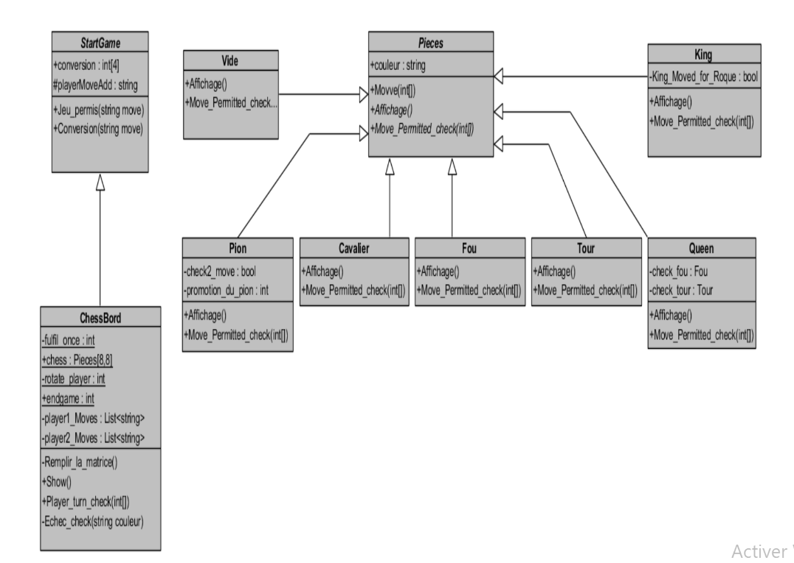

# Chess-Game
Console Chess Game for two players made with C# 

<b>W ---> white</b>  
<b>B ---> Black </b> 
<b>Q ---> Queen </b> 
<b>B ---> Black </b> 
<b>T ---> Rock </b> 
<b>C ---> Knight </b> 
<b>P ---> Pawn </b> 
<b>F ---> Bishop </b>
